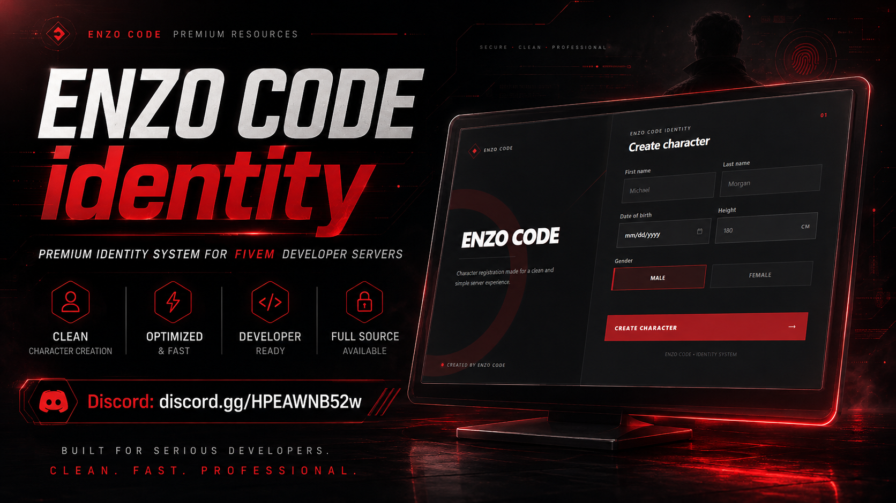

<div align="center">

# EN-identity

FiveM identity registration for ESX with a custom dark-red NUI.

**ENZO CODE**

[Discord](https://discord.gg/HPEAWNB52w)

</div>



## Features

- Custom identity registration UI
- Dark-red theme
- First name and last name checks
- Date of birth checks
- Height checks
- Gender selection
- ESX identity support
- ESX multichar support
- Character deletion support
- Startup console banner
- Resource name lock
- Test command for the UI

## Requirements

- `es_extended`
- `esx_skin`
- `oxmysql`

## Installation

1. Put the `EN-identity` folder in your resources folder.
2. Keep the folder name exactly `EN-identity`.
3. Make sure the required resources start before this one.
4. Add this to `server.cfg`:

```cfg
ensure EN-identity
```

5. Keep this option disabled in `config.lua`:

```lua
Config.UseDeferrals = false
```

6. Restart the server.

## Test Command

Open the UI in game:

```text
/testidentity
```

You can also run this from F8:

```text
testidentity
```

## Config

The main settings are in `config.lua`:

- Locale
- First and last name limits
- Minimum and maximum height
- Date format
- Birth year range
- Character deletion
- Deferral mode

## Resource Name

The resource name must stay:

```text
EN-identity
```

If the folder is renamed, the resource prints an error in the server console and stops.

## Preview

Put your screenshot here:

```text
images/preview.png
```

## Support

**ENZO CODE**  
Discord: https://discord.gg/HPEAWNB52w

## License

This resource is released under GPL-3.0. Check `LICENSE` and `NOTICE.md` for the license details.
